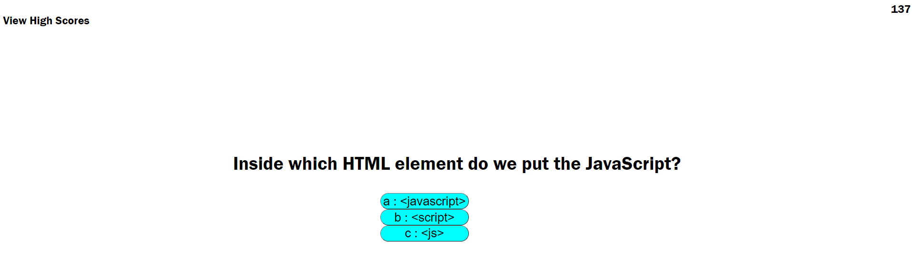
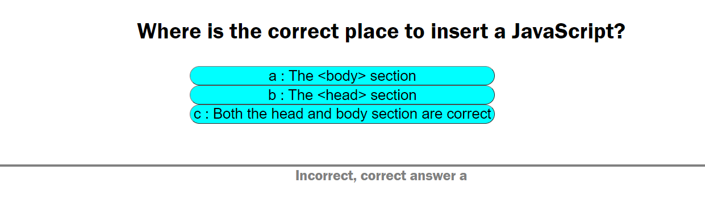
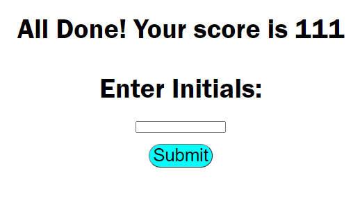
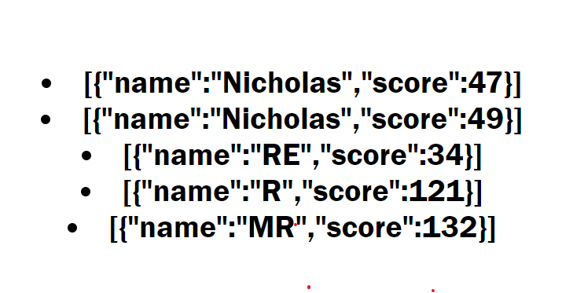

# code_quiz

The following project was conducted to create an application that takes a user through a quiz on javascript. The quiz is timed and the goal is to complete the quiz as fast as possible. The score given is related to the time that is counting down as a user completes the quiz. 10 seconds is deducted if the user gets the question incorrect.

<H2>Author</H2>
Nick Ross

<H2>Functionality</H2>

When clicking start the quiz begins and the timer begins to tick down. The user is presenting with a question and they receive immediate feedback if the question is correct or incorrect.

When all questions are answered, the user is asked to enter their initials to record a score. The score is stored in local storage.

When a user clicks on high score, all scores are presented from local storage

